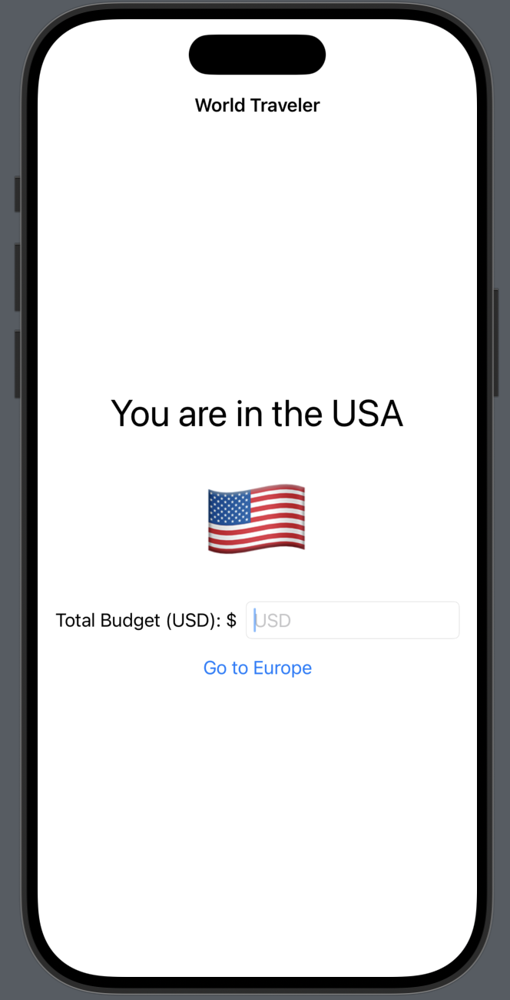
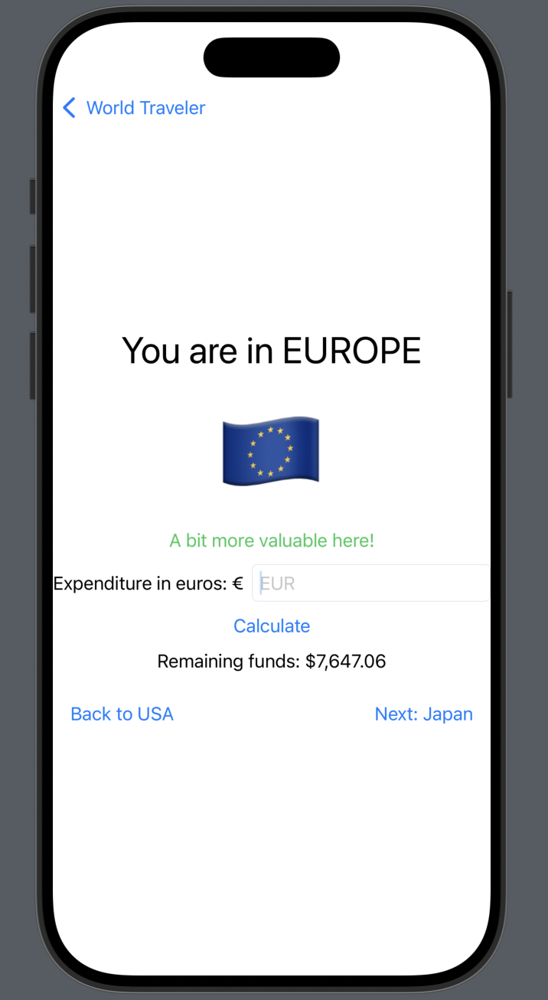
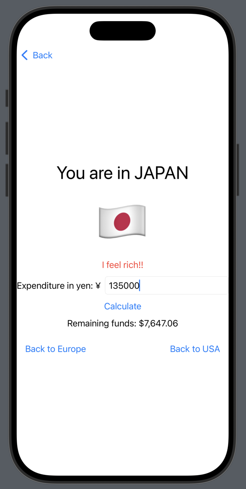

# 🌍 World Traveller Currency Budget App

An iOS SwiftUI project that simulates traveling between the **USA**, **Europe**, and **Japan** with a budget in USD.  
Users can input their total budget, spend money in EUR or JPY (with fixed conversion rates), and track their remaining funds as they navigate between regions.

---

## ✨ Features
- Start in the **USA** by entering your total budget in USD.
- Travel to **Europe**:
  - Shows a message: *“A bit more valuable here!”*
  - Enter EUR expenditure, converted at **1 USD = 0.85 EUR**.
- Travel to **Japan**:
  - Shows a message: *“I feel rich!!”*
  - Enter JPY expenditure, converted at **1 USD = 110 JPY**.
- Track **remaining funds** at every step.
- Navigate back to the **USA** at any time:
  - Shows a message: *“Coming back from a foreign land.”*
- Built using **SwiftUI NavigationStack + NavigationPath**.

---

## 📸 Screenshots


 

---

## 🛠️ Technologies
- **Swift 5 / SwiftUI**
- **NavigationStack & NavigationPath**
- Runs on **Xcode 15+ / iOS 17+**

---

## 🚀 Getting Started

1. Clone this repository:
   ```bash
   git clone https://github.com/arhanjoshi/World_Traveller_Currency_Budget_App.git
